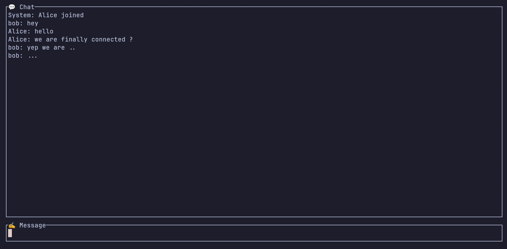
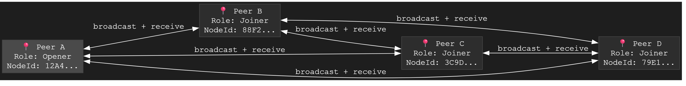
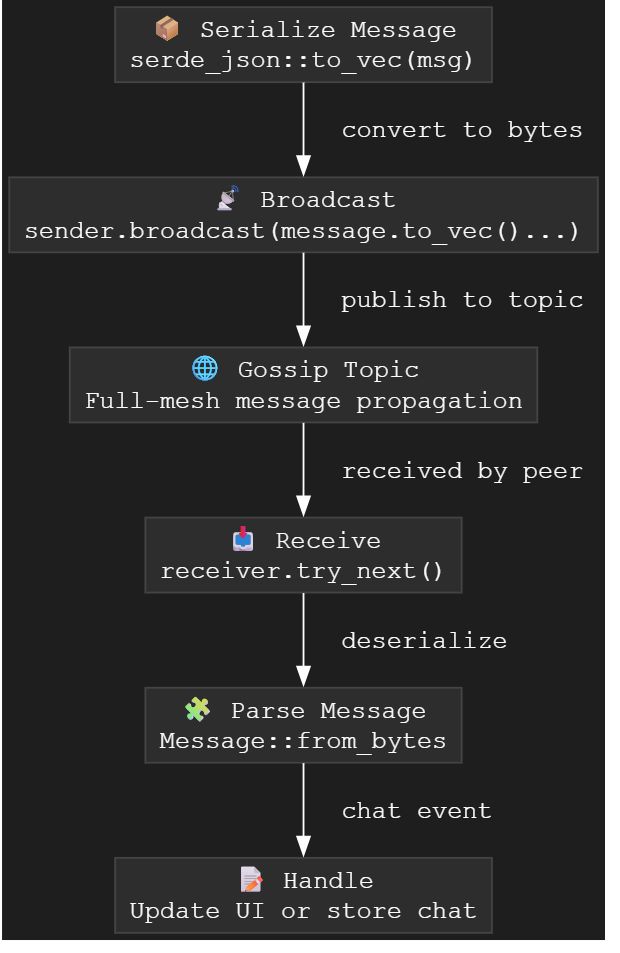

# 🌐 MeshSpace

> Binding Nodes, Broadcasting Connections

## 1. What is MeshSpace?

MeshSpace is a minimal, terminal-based peer-to-peer (P2P) chat application. It allows multiple users to communicate directly without relying on central servers. It uses a full mesh topology and gossip-based message propagation.

Built for learning, experimenting, and demonstrating P2P communication using Rust.

## 2. Why Use MeshSpace?

- 🛜 **Decentralized Communication** — No servers, no intermediaries.
- ⚡ **Fast & Lightweight** — Rust-powered with efficient terminal UI.
- 🔐 **Private by Design** — Local-only chat with no central logging.
- 🧪 **Hackable & Extensible** — A great base to explore P2P, gossip protocols, or TUI development.

## 3. Tech Stack

- 🦀 **Rust** — Systems-level performance and safety.
- 📡 **iroh-gossip** — Gossip-based pub-sub protocol for message exchange.
- 🧵 **ratatui** — For creating the interactive terminal-based user interface (TUI).

## 4. Project Structure

```

├── assets
│   ├── chat\_interface.png               # Screenshot of the TUI chat
│   ├── full-mesh-flow\.png               # Peer-to-peer full mesh diagram
│   ├── sender-receiver-flow\.png         # Message flow illustration
│   └── serialization-to-reception-flow\.png # Gossip message lifecycle
├── docs
│   ├── networking.md                    # Networking topology and behavior
│   ├── peer\_discovery.md                # How peers discover each other
│   └── tui.md                           # Explanation of terminal UI design
├── README.md                            # You are here
├── Rust
│   ├── Cargo.lock
│   ├── Cargo.toml
│   └── src
│       └── main.rs                      # Entry point of the app
├── test.md                              # Notes or ideas for future tests
└── ui.md                                # UI layout drafts or references

```

## 5. How to Run It

### Prerequisites

- Rust (latest stable recommended)
- Git

### Run Steps

```bash
git clone https://github.com/jigyasha-rjb/MeshSpace
cd MeshSpace/Rust
cargo run
```

- When prompted, optionally enter your name and port.

- Choose to open a new chat room or join an existing one.

- If opening a new room, share the generated Ticket with peers.

- If joining, enter the Ticket you received.

- Open multiple terminal windows to simulate peers chatting.

## 6. Documentation

See the [`docs/`](./docs) folder for:

- 📡 `networking.md` – Overview of the mesh and message flow
- 🔍 `peer_discovery.md` – How peers find each other
- 🎨 `tui.md` – Terminal UI layout and logic

## 7. License

📝 Licensed under the [MIT License](./LICENSE).

---

## 📸 Screenshots

| Chat Interface                     | Full Mesh Flow                     | Message Lifecycle                                   |
| ---------------------------------- | ---------------------------------- | --------------------------------------------------- |
|  |  |  |

---

> Developed by [@pujan-Dev](https://github.com/Pujan-Dev) and [@jigyasha-rjb](https://github.com/jigyasha-rjb)
